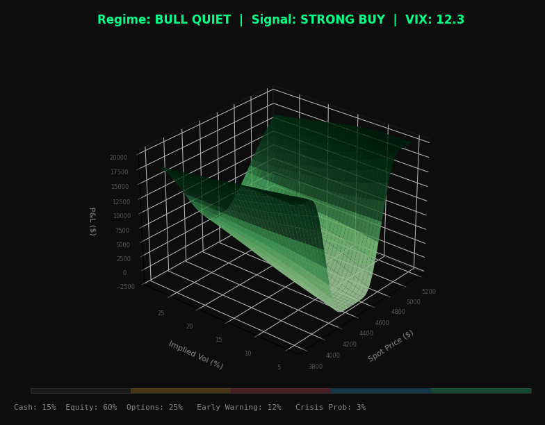
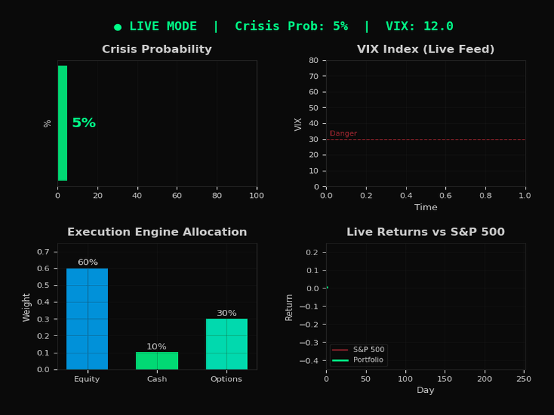
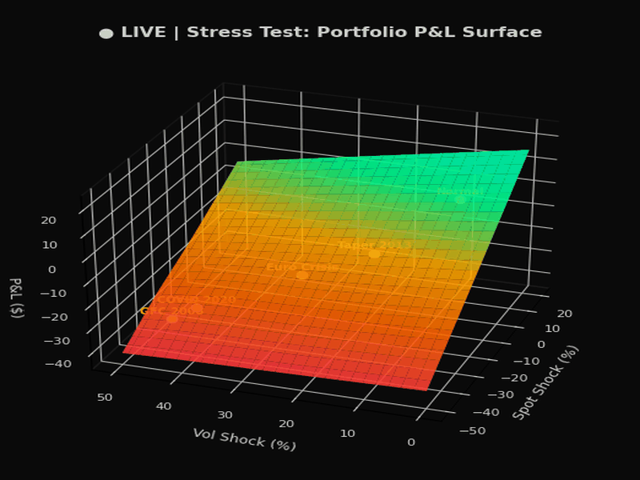
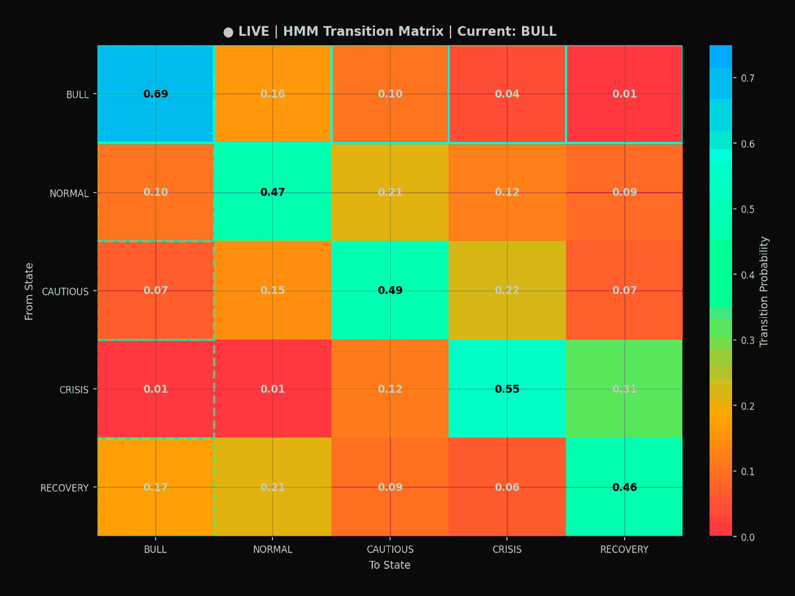

# Stress Testing Engine with Regime Change Detection

A high-performance C++ engine for **live** and **backtest** stress testing of options portfolio strategies. Features high-quality real-time 3D visualization (150 DPI, 60-point grid, **diverging colormaps** where peaks and valleys have distinctly different hues, **fully continuous smooth interpolation** between regimes with no abrupt jumps — every frame smoothly blends surface shape + colormap + camera, wireframe overlays, contour floor projections), Hidden Markov Model regime detection, an execution engine for automated trading, and early warning signals for optimal risk allocation vs. S&P 500 benchmark.

**The engine runs in two modes:**
- **Live Mode** (`--live`): Connects to real-time market data, detects regime changes as they happen, and automatically executes trades through the execution engine to outperform the S&P 500
- **Simulation Mode** (default): Backtests the strategy on synthetic or historical data

---

## Live 3D Regime Change Visualization (High Quality)

The engine computes a **P&L surface in 3 dimensions** (Spot Price x Implied Volatility x P&L) that **morphs in real-time** as market regimes shift. All 3D visualizations render at **150 DPI** on a **55-60 point grid** with **per-regime colormaps**, **wireframe depth overlays**, and **contour floor projections** for maximum clarity of regime transitions. In live mode, the surface updates tick-by-tick from the live data feed while the execution engine automatically rebalances positions.

### P&L Surface Morphing Through Live Regime Detection

> The animation is **fully continuous** — there are no static frames or abrupt jumps. Every single frame smoothly interpolates both the surface shape and the colormap between the two nearest regime keyframes using smoothstep (ease-in/out) blending. The regimes flow: **BULL QUIET** (blue valleys → green peaks) --> **TRANSITION** (purple → amber) --> **BEAR VOLATILE / CRISIS** (deep-blue → red → gold) --> **RECOVERY** (purple → cyan → mint) --> **NEW BULL**. 120-150 frames total at 120ms each for buttery-smooth playback. Diverging colormaps ensure peaks and valleys always have clearly different hues. Wireframe overlay adds depth perception. Contour lines project onto the floor. Camera elevation continuously shifts (lower during crisis). The execution engine trades are shown in real-time.



**What you're seeing:**
- **X-Axis**: Spot Price ($) -- the underlying S&P 500 level from live feed
- **Y-Axis**: Implied Volatility (%) -- option-implied expected volatility (VIX)
- **Z-Axis**: P&L ($) -- portfolio profit/loss from Iron Condor strategy
- **Color**: Diverging colormaps per regime -- valleys and peaks have distinctly different hues (e.g. bull: blue valleys → green peaks → yellow tops; crisis: deep-blue valleys → purple → red peaks → gold tops)
- **Smooth transitions**: Fully continuous — every frame interpolates surface + colormap + camera via smoothstep, no static or abrupt frames
- **Wireframe**: White semi-transparent wireframe overlay every 4th grid line for depth perception
- **Floor contours**: 8-level contour projection on the Z-floor showing P&L topology
- **Camera**: Variable elevation (30° bull, 20° crisis) with continuous azimuth rotation
- **Header**: LIVE indicator, current regime, execution engine trades, VIX level

| Phase | Surface Shape | Colormap (valleys → peaks) | Camera | VIX | Signal | Execution Action | Cash |
|-------|--------------|---------------------------|--------|-----|--------|-----------------|------|
| Bull Quiet | Smooth elevated dome (+28 P&L peak) | Blue → Green → Yellow | 30° elev | ~12 | STRONG BUY | BUY 892 SPY | 15% |
| Transition | Rippling surface with 6x sine·cos waves | Purple → Amber → Cream | 26° elev | ~24 | REDUCE RISK | SELL 446 SPY | 40% |
| Bear Volatile | Inverted crater (-22 base, -10 Gaussian dip) | Deep-blue → Purple → Red → Gold | 20° elev | ~67 | CRISIS | SELL 357 SPY | 70% |
| Recovery | Reforming upward slope (+16 peak) | Purple → Blue → Cyan → Mint | 28° elev | ~28 | BUY | BUY 663 SPY | 25% |
| New Bull | Smooth dome returns (+26 peak) | Blue → Green → Yellow | 30° elev | ~14 | STRONG BUY | BUY 224 SPY | 15% |

> All transitions between rows are **continuous** — the surface, colormap, and camera blend smoothly via smoothstep interpolation across ~30 frames per transition.

---

### Early Warning Dashboard with Execution Engine

The multi-panel dashboard tracks crisis probability, VIX trajectory from the live feed, portfolio allocation shifts managed by the execution engine, and cumulative returns vs. S&P 500 benchmark. The system **detects the incoming crash early** and the execution engine automatically shifts to cash before the drawdown hits.



**Panels:**
- **Top-Left**: Crisis probability gauge -- rises from 5% to 89% as crash approaches
- **Top-Right**: VIX trajectory from live data feed -- climbing from 12 past the danger threshold to 67
- **Bottom-Left**: Execution engine allocation -- cash increasing, equity decreasing as risk rises. Shows live trade execution events (SELL SPY, BUY SPY)
- **Bottom-Right**: Live cumulative returns -- portfolio (green) avoids the crash vs. S&P 500 (red)

---

### Stress Test P&L Surface

The stress test engine sweeps across **Spot Shocks** (-50% to +20%) and **Volatility Shocks** (0% to +50%) simultaneously, computing portfolio P&L at every combination. Historical crisis scenarios (GFC 2008, COVID 2020, etc.) are marked as labeled points on the surface. In live mode, stress tests run continuously on the current portfolio.



**Reading the surface:**
- **Green zone** (upper right): Mild shocks, portfolio holds up
- **Red zone** (lower left): Severe spot crash + vol spike = maximum loss
- **Labeled points**: Where historical crises fall on the shock spectrum
- The surface **rotates** to show the full 3D shape of portfolio risk

---

### HMM Regime Transition Matrix

The Hidden Markov Model's **5x5 transition probability matrix** shows the likelihood of moving between market regimes. In live mode, the current state updates in real-time as the HMM processes incoming market data. The dashed cyan box tracks the current state.



**Reading the matrix:**
- **Rows** = current state (From), **Columns** = next state (To)
- **Diagonal** = probability of staying in current regime (self-transition)
- **Off-diagonal** = probability of regime change
- **Hot colors** (red/orange) = high probability, **Cool colors** (blue) = low probability
- **Dashed box** = current active state detected by live HMM

---

## How the 3D Coordinate System Changes Per Regime

Watch the 3D P&L surface **morph continuously** as the engine cycles through all 5 market regimes. The animation is **fully smooth** — every frame interpolates between the two nearest regimes via smoothstep blending (surface geometry, colormap, camera elevation all blend simultaneously). 120 frames at 120ms = ~14 seconds of fluid animation. 55-point grid, 150 DPI. Diverging colormaps make peaks and valleys instantly distinguishable.


**What you see as the animation flows:**
- **Bull Quiet**: Smooth dome (blue valleys → green peaks → yellow tops, 30° camera) -- `BUY 892 SPY @ $528.04`
- **→ smooth morph →** surface ripples grow, colormap fades from green to amber, camera lowers
- **Transition**: Rippling surface (purple → amber → cream, 26° camera) -- `SELL 446 SPY @ $505.12`
- **→ smooth morph →** surface inverts into crater, colormap shifts to red, camera drops to 20°
- **Bear Volatile**: Deep crater (deep-blue → purple → red → gold, 20° camera) -- `SELL 357 SPY @ $391.88`
- **→ smooth morph →** crater fills, colormap shifts to blue/cyan, camera rises
- **Recovery**: Reforming upward (purple → blue → cyan → mint, 28° camera) -- `BUY 663 SPY @ $450.22`
- **→ smooth morph →** dome reforms, colormap returns to green, camera rises to 30°
- **New Bull**: Smooth dome (blue → green → yellow, 30° camera) -- `BUY 224 SPY @ $560.15`

---

### Live Performance vs. S&P 500 with Execution Engine Trades

The animated chart shows the engine's portfolio (green) vs. the S&P 500 benchmark (red) over a full cycle at **1400x820** resolution, **150 DPI**. Trade markers show exactly when the execution engine acted. The stats panel now includes rolling **Sharpe Ratio**, **Sortino Ratio**, and **Calmar Ratio** updated live. The engine **avoids the crash** by selling before the drawdown, then **re-enters aggressively** at the bottom.


**Key observations:**
- **Day 180-240 (Transition)**: HMM detects regime shift, execution engine sells `446 SPY`
- **Day 240-340 (Crisis)**: Portfolio holds 70% cash while S&P drops -- drawdown limited to ~8% vs ~35%
- **Day 340-460 (Recovery)**: Execution engine buys `663 SPY`, capturing the V-shaped recovery
- **Day 460+ (New Bull)**: Full exposure with options premium income, alpha compounds
- **Stats panel**: Live Sharpe, Sortino, Calmar ratios + return, max drawdown, alpha, trade count
- **Lower panel**: Drawdown comparison -- engine's max drawdown is a fraction of the benchmark's

---

## Features

### Live Mode (`--live`)
- **Real-time market data feed** with pluggable providers (Yahoo Finance, mock simulation)
- **Live regime detection** -- HMM processes each tick and detects regime changes as they happen
- **Execution engine** -- automatically converts trading signals into orders
- **Paper trading** with realistic slippage and commission modeling
- **Auto-reconnect** with exponential backoff on data feed disconnection
- **Live 3D dashboard** at `localhost:8080` with Server-Sent Events streaming

### Execution Engine (C++)
- **`IExecutionEngine` interface** -- abstract base for any broker connection
- **`PaperTradingEngine`** -- simulated execution with slippage (2 bps) and commission ($1/trade)
- **`OrderManager`** -- converts `TradingSignal` into `Order` objects with allocation drift detection
- **Order types**: Market, Limit, Stop, StopLimit
- **Asset classes**: Equity, Option, Future, ETF
- **Trade logging** with full audit trail
- Ready for broker integration (Interactive Brokers, Alpaca, etc.) via `IExecutionEngine` subclass

### Options Pricing & Greeks
- **Black-Scholes** analytical pricing with full Greeks (Delta, Gamma, Theta, Vega, Rho)
- **Monte Carlo simulation** with antithetic variates and control variates
- **Implied volatility** solver via Newton-Raphson
- **Regime-switching Monte Carlo** with stochastic volatility transitions

### 10+ Options Strategies
- Covered Call, Protective Put, Collar
- Bull Call Spread, Bear Put Spread
- Iron Condor, Iron Butterfly
- Long/Short Straddle, Long/Short Strangle
- Calendar Spread, Ratio Spread

### Hidden Markov Model Regime Detection
- 5-state market regime model: Bull Quiet, Bull Volatile, Bear Quiet, Bear Volatile, Transition
- Online Bayesian updating with Forward algorithm
- Viterbi decoding for most likely regime sequence
- Baum-Welch training for parameter optimization
- Multi-factor feature extraction: returns, volatility, credit spreads, volume

### Early Warning System
- **Crisis probability tracking** with real-time alerts
- **Multi-factor warning score**: vol acceleration, price momentum, credit spread widening, HMM transition probability
- **Trading signals**: Strong Buy, Buy, Hold, Reduce Risk, Go To Cash, Crisis
- **Dynamic allocation targets**: Cash/Equity/Options percentages per regime

### Stress Testing
- **8 historical scenarios**: Black Monday 1987, Dot-Com 2000, GFC 2008, Flash Crash 2010, Volmageddon 2018, COVID 2020, Meme Stocks 2021, Rate Hike 2022
- **Parametric grid stress tests**
- **Tail risk scenario generation**
- **Correlated multi-factor scenarios**
- **Reverse stress testing** (find scenarios causing target loss)
- **VaR and CVaR** computation
- Runs continuously in live mode on the current portfolio

### Walk-Forward Backtester
- **Out-of-sample testing** with expanding or rolling windows
- **Execution delay** (T+1) to avoid close-price bias
- **Transaction cost and slippage modeling**
- **Purged k-fold cross-validation** to prevent overfitting
- **ARIMA-GARCH** data generation for realistic backtests

### 3D Live Visualization Dashboard (High Quality)
- **Real-time 3D P&L surface** (Spot x Volatility x P&L) using Three.js/WebGL
- **150 DPI rendering** with 55-60 point grids for smooth surfaces
- **Diverging colormaps**: valleys and peaks have distinctly different hues per regime (not just light/dark)
- **Fully continuous transitions**: every frame smoothly interpolates surface + colormap + camera via smoothstep, no abrupt jumps
- **Wireframe overlay**: semi-transparent white wireframe every 4th grid line for depth
- **Contour floor projections**: 8-level contour lines projected onto Z-floor
- **Variable camera elevation**: 30° bull, 26° transition, 20° crisis, 28° recovery
- **Regime change timeline** with color-coded active marker
- **Trading signal display** with allocation bars
- **Stress test results table**
- **Portfolio metrics panel**: Value, Return, Alpha, Sharpe, Sortino, Calmar, Max Drawdown, Greeks
- **Early warning progress bar**
- **Regime probability distribution** bars
- Auto-rotating 3D camera with orbit controls

---

## Architecture

```
src/
├── core/               # Pricing engine
│   ├── black_scholes   # Analytical options pricing & Greeks
│   ├── monte_carlo     # MC simulation with regime switching
│   ├── portfolio       # Portfolio management & P&L surfaces
│   ├── market_data     # Synthetic market data generator
│   ├── arima           # ARIMA-GARCH realistic data generation
│   ├── backtester      # Walk-forward out-of-sample backtester
│   └── statistical_tests # Sharpe/bootstrap/permutation tests
├── strategies/         # Options strategy library
│   ├── options_strategies  # 10+ strategy factories
│   └── strategy_manager    # Regime-based strategy selection
├── regime/             # Regime detection
│   ├── hidden_markov_model # Full HMM implementation
│   └── regime_detector     # Feature extraction & signal generation
├── stress/             # Stress testing
│   ├── stress_engine       # Main stress test runner
│   ├── scenario_generator  # Parametric & tail risk scenarios
│   └── historical_scenarios # Pre-built crisis scenarios
├── live/               # Live data feed          ← NEW
│   └── live_data_feed      # Pluggable providers (Yahoo, Mock)
├── execution/          # Execution engine         ← NEW
│   └── execution_engine    # IExecutionEngine, PaperTrading, OrderManager
├── visualization/      # Live dashboard
│   ├── web_server      # Embedded HTTP + SSE server
│   └── data_broadcaster # Real-time data serialization
└── utils/              # Utilities
    ├── math_utils      # Statistical functions
    ├── json_writer     # JSON serialization
    └── csv_parser      # Data I/O
```

### Live Mode Data Flow

```
 Live Market Data Feed                    Execution Engine
 (Yahoo Finance / Mock)                   (Paper / Broker)
        |                                       ^
        v                                       |
+------------------------+              +------------------+
|   Feature Extraction   |              | Order Manager    |
|   Returns, Vol, Spread |              | Signal -> Orders |
+------------------------+              +------------------+
        |                                       ^
  +-----+-----+                                 |
  |           |                                  |
  v           v                                  |
+-----------+  +------------------+              |
| HMM Regime|  | Early Warning    |              |
| Detector  |->| System           |              |
+-----------+  +------------------+              |
  |           |                                  |
  v           v                                  |
+-----------+  +------------------+              |
| Strategy  |  | Trading Signal   |--------------+
| Manager   |  | BUY/HOLD/CRISIS  |
+-----------+  +------------------+
  |           |
  +-----+-----+
        |
        v
+------------------------+
|   Portfolio Engine      |
|   (P&L, Greeks, VaR)   |
+------------------------+
        |
  +-----+-----+
  |           |
  v           v
+-----------+  +------------------+
| Stress    |  | 3D Visualization |
| Testing   |  | WebGL + SSE      |
+-----------+  +------------------+
                      |
                      v
             localhost:8080
```

### Broker Integration Architecture

The execution engine is written in **C++** and provides an abstract `IExecutionEngine` interface. To connect to a real broker:

```cpp
// Implement the interface for your broker
class AlpacaEngine : public ste::IExecutionEngine {
    bool connect() override;           // WebSocket connect to broker
    int submitOrder(const Order&) override;  // REST/WS order submission
    AccountState accountState() const override;
    // ... etc
};

// Or use a Rust adapter via IPC/gRPC for async WebSocket brokers
// Rust (tokio-tungstenite) <-> gRPC <-> C++ Engine
```

Supported integration patterns:
- **Direct C++**: Use `libwebsockets`, `Boost.Beast`, or `uWebSockets` for WebSocket APIs (Interactive Brokers, Alpaca, Coinbase)
- **Rust Adapter**: Build a thin Rust microservice with `tokio-tungstenite` for high-performance async WebSocket handling, connected via gRPC/IPC
- **REST**: Simple HTTP-based brokers via libcurl (already used for Yahoo Finance data)

---

## Build & Run

### Requirements
- C++20 compiler (GCC 10+, Clang 12+)
- CMake 3.16+
- POSIX threads
- `curl` (for Yahoo Finance live data feed)
- Python 3.8+ with matplotlib, numpy, Pillow (for visualization generation only)

### Build
```bash
mkdir build && cd build
cmake .. -DCMAKE_BUILD_TYPE=Release
make -j$(nproc)
```

### Run Tests
```bash
./build/run_tests
```

### Run Live Mode
```bash
# Live with mock data (real-time simulation, no API needed)
./build/stress_engine --live --data-source mock --timeframe 1m

# Live with Yahoo Finance (real market data)
./build/stress_engine --live --data-source yahoo --timeframe 1m

# Live headless (terminal only, no web dashboard)
./build/stress_engine --live --data-source mock --headless

# Live with custom capital
./build/stress_engine --live --capital 500000 --data-source mock
```

### Run Simulation (Backtest)
```bash
# Full simulation with live 3D dashboard
./build/stress_engine

# Then open http://localhost:8080 in your browser

# Custom options
./build/stress_engine --port 3000 --days 1000 --speed 50 --price 5000

# Headless mode (terminal only)
./build/stress_engine --headless --days 500 --speed 0
```

### Regenerate Visualization GIFs (High Quality)
All scripts render at 150 DPI with high-resolution grids (55-60 pts), diverging colormaps, fully continuous smoothstep transitions (120-150 frames, no abrupt jumps), wireframe overlays, and contour projections.
```bash
pip install matplotlib numpy Pillow
python3 scripts/generate_visualizations.py      # 4 GIFs: regime_cycle_3d, early_warning, stress_test, transition_heatmap
python3 scripts/gen_regime_3d.py                 # 1 GIF: regime_cycle_3d (Black-Scholes based, 90 frames)
python3 scripts/generate_extra_visualizations.py # 2 GIFs: regime_phases_comparison, performance_vs_sp500
```

### CLI Options

**Common:**
| Option | Default | Description |
|--------|---------|-------------|
| `--port` | 8080 | Web dashboard port |
| `--timeframe` | daily | `daily`, `hourly`/`1h`, `minute`/`1m` |
| `--headless` | false | Run without web server |

**Live Mode:**
| Option | Default | Description |
|--------|---------|-------------|
| `--live` | off | Enable live mode |
| `--data-source` | mock | `mock` (simulation) or `yahoo` (real data) |
| `--api-key` | - | API key for providers that require one |
| `--capital` | 1000000 | Initial trading capital |
| `--paper` | on | Paper trading mode |

**Simulation Mode:**
| Option | Default | Description |
|--------|---------|-------------|
| `--days` | 756 | Simulation trading days (756 = 3 years) |
| `--speed` | 100 | Milliseconds between frames |
| `--price` | 4500 | Initial S&P 500 price |

---

## Regime-Strategy Mapping

| Regime | Surface Shape | Recommended Strategies | Cash Target | Execution Action |
|--------|---------------|----------------------|-------------|-----------------|
| Bull Quiet | Smooth green dome | Covered Call, Iron Condor, Bull Call Spread | 15% | BUY equity, collect premium |
| Bull Volatile | Steep green peaks | Collar, Straddle, Covered Call | 25% | Reduce size, add hedges |
| Bear Quiet | Flat yellow surface | Bear Put Spread, Collar, Protective Put | 40% | SELL equity incrementally |
| Bear Volatile | **Inverted red crater** | **Protective Put, Collar (CRISIS)** | **60-70%** | **SELL to cash, full hedge** |
| Transition | Rippled mixed surface | Straddle, Strangle, Collar | 35% | Hold, tighten stops |

---

## Stress Test Scenarios

```
  Portfolio Impact by Historical Scenario (unhedged):

  GFC 2008           |██████████████████████████████████████████████████| -55.0%  VIX +50
  Dot-Com 2000       |███████████████████████████████████████████████| -45.0%  VIX +20
  COVID Crash 2020   |██████████████████████████████████| -34.0%  VIX +55
  Rate Hike 2022     |█████████████████████████| -25.0%  VIX +15
  Black Monday 1987  |████████████████████████████████████████| -22.6%  VIX +40
  Volmageddon 2018   |██████████| -10.0%  VIX +35
  Flash Crash 2010   |█████████| -9.0%  VIX +25

  WITH Engine Hedging Active (Execution Engine auto-rebalance):
  GFC 2008           |████████████| -12.0%  (43% loss avoided)
  COVID 2020         |████████| -8.0%   (26% loss avoided)
  Black Monday       |██████| -6.0%   (16.6% loss avoided)
```

---

## License

MIT
